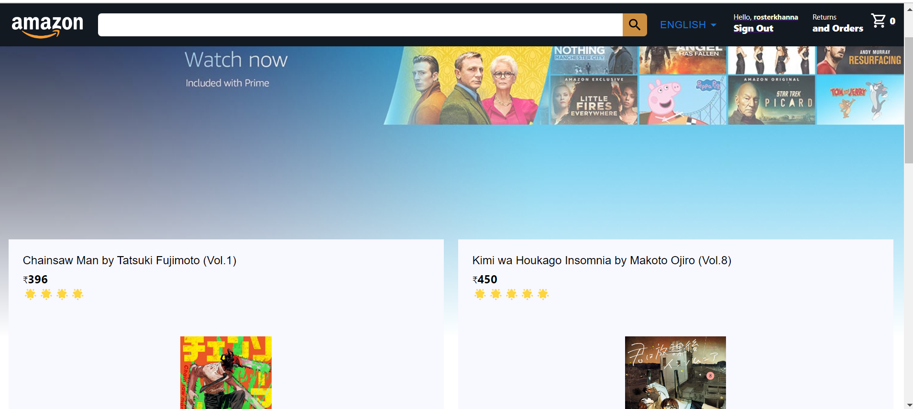

# Full-Stack AMAZON Clone with REACT JS and Firebase

It's a full stack amazon clone. For frontend I used React JS and in backend I used Firebase.This app is basic implementation of amazon app not a complete version.

## App Demo

\

## Checkout The App

[App Link](https://clone-73799.web.app/)
